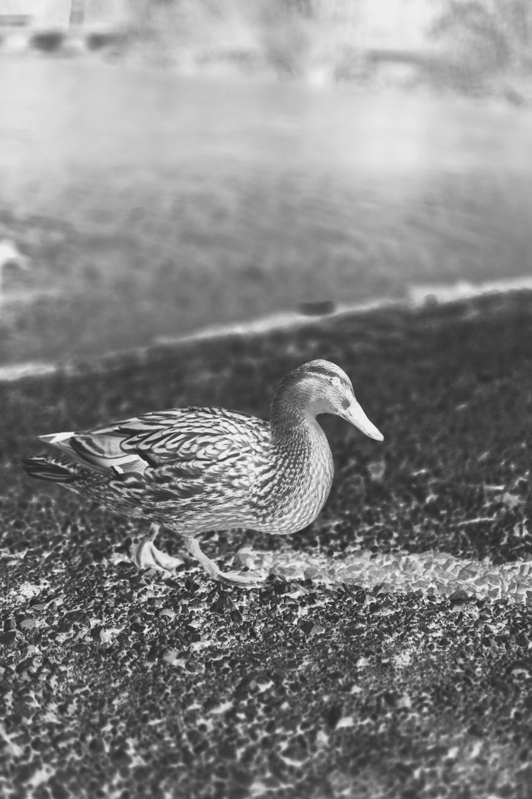
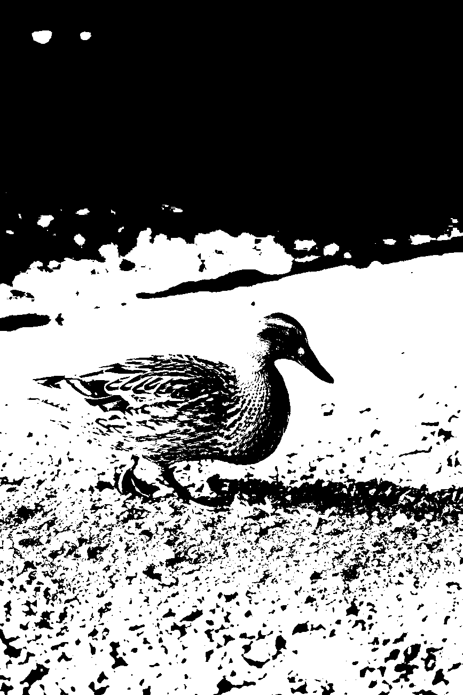
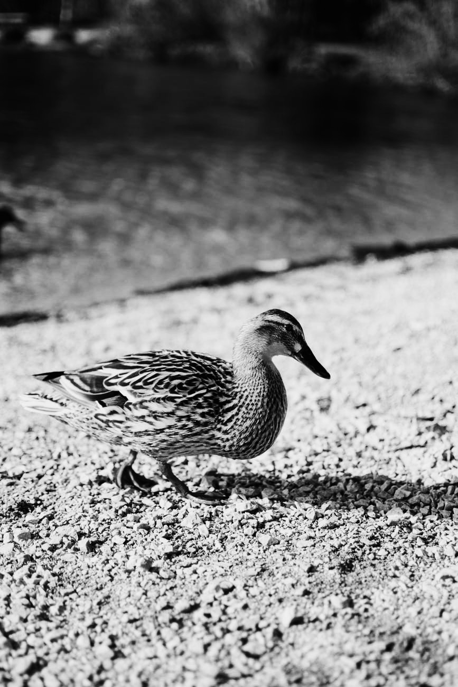
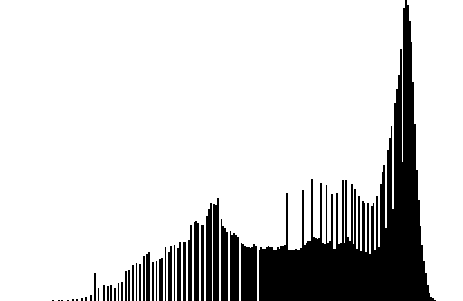
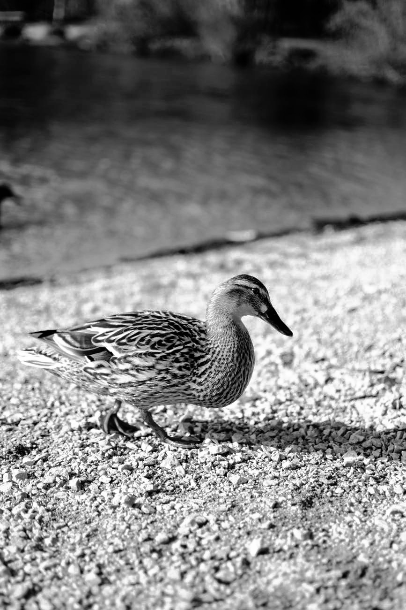

# Monadické operace

Samotné implementace operací se nachází v třídě Editor - [monadic.cpp](../src/monadic.cpp), [Editor.hpp](../src/editor.hpp). Všechny operace jsou demonstrovány na obrázku `cica.png`. Následující operace jsou naimplementovány:

## Negativ
```
open cica.png
negate
save png negate
histogram histonegate
```


<br>


<br>


<br>


## Prahování
```
open cica.png
threshold 0.5
save png threshold
histogram histothres
```


<br>


<br>


<br>


## Jas
```
open cica.png
brightness 0.1
save png brightness
histogram histobrightness
```


<br>


```
brightness 0.2
```


<br>


Hodnoty v histogramu v pravo jsou mrňavé dole v porovnáním s hodnotami vpravo...

## Kontrast
```
open cica.png
contrast 0.5
save png contrast
histogram histocontrast
```


<br>


```
brightness 1.25
```


<br>


## Gamma
```
open cica.png
gamma 2
save png gamma
histogram histogamma
```


<br>


```
gamma 1.75
```


<br>


## Nelineární kontrast
```
open cica.png
nonlincontrast 0.5
save png nonlincontrast
histogram histononlinear
```


<br>


<br>


<br>


## Logaritmická škála
```
open cica.png
logscale 8
save png logscale
histogram histolog
```


<br>


<br>


<br>



## Kvantizace
```
open cica.png
quantize 5
save png quantize
histogram histoquantize
```


<br>


<br>


<br>


## Ekvalizace
```
open cica.png
equalize
save png equlized
histogram histoequlized
```


<br>


<br>


<br>


## Něco navíc...
Umí to kreslit histogram do terminálu! Implementace v [Editor.cpp](../src/editor.cpp) bude chtít trochu refaktorizace.


